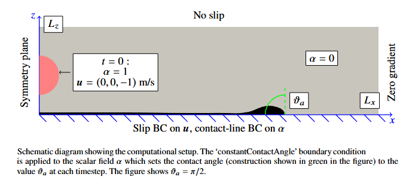

# droplet2D

Sample OpenFOAM case of a 2D droplet impact event.

The case is included in the SAMPLE directory and includes:

* case
* mesh

The simulation is run from the case/ directory.

# Postprocessing

Sample MATLAB files for postproessing are available in the matlab/ directory.

# Citation

droplet2D has a DOI that can be included in citations: 

