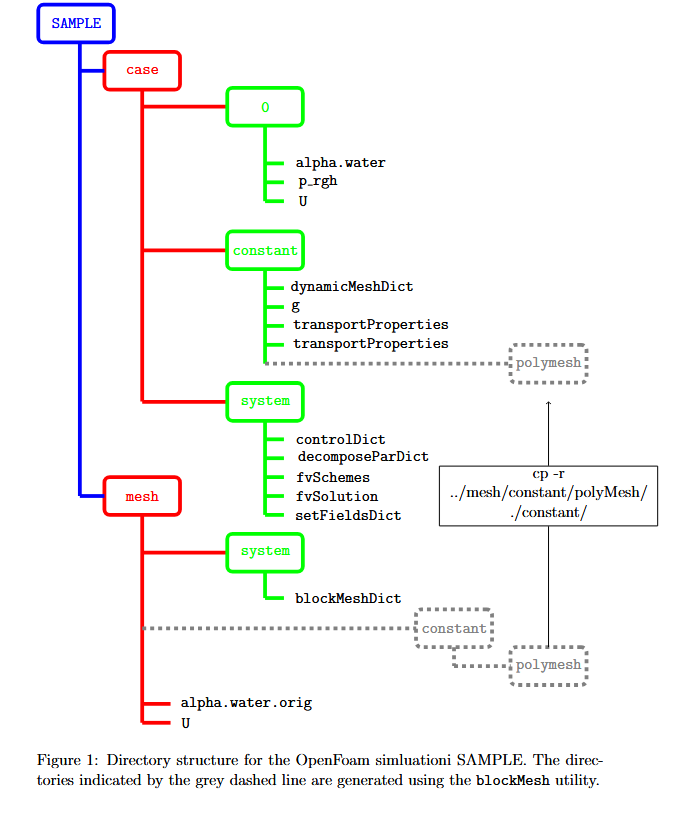

# droplet2D/SAMPLE

This directory contains a sample OpenFOAM case showcasing how the 2D droplet impact simulations were produced.  

# Directory Structure

The SAMPLE/ directory contains two key directories for running the simulation:

•	case/ Holds the OpenFOAM case setup (control files, initial/boundary conditions, solver settings). 

•	mesh/ Contains the computational grid used for the simulation. 

These two directories must be read together.  The directory structure (including sub-directories is shown in the schematic diagram.

# How the case is set up

The case is already set up for the simulation in the schematic diagram which accompanies this repository.  To understand this set-up in more detail, or to fine-tune the case, here are some key steps:

(i)	Fine-tune parameters in the case/ directory, including but not limited to:

•	Physical parameters (surface tension, gas and liquid viscosities and densities), etc. in constant/transportProperties

•	Frequency at which snapshots of the simulation state  are saved to files in constant/system/controlDict

(ii)	Set up a domain decomposition for execution of the code in parallel, if required, in constant/system/decompseParDict

(iii)	Customize the initial conditions in the the following files, if required:

•	mesh/alpha.water.orig

•	mesh/U

(iv)	Customize the mesh in the mesh/directory, if required.  This can be done by making changes to the blockmesh, in /mesh/system/blockMeshDict file.

# How to run the case

Here are the basic commands to run the SAMPLE case on a Linux terminal:

(i)	First, start in the mesh directory:
cd mesh

(ii)	Remove old mesh and regenerate mesh:
rm -r constant/polyMesh
blockMesh

(iii)	Change into the case directory:
cd ../case

(iv) Remove old mesh from the case directory and copy in the regenerated mesh:
rm -r constant/polyMesh/
cp -r ../mesh/constant/polyMesh/ ./constant/

(iv)	Copy over basic initial conditions into the case directory:
cp ../mesh/alpha.water.orig 0/alpha.water
cp ../mesh/U 0/U

(v)	Any special initial conditions in these files have to be implemented as follows:
setFields

Thus, for example, alpha.water.orig has an instruction for the initial droplet to be initialized as a cylinder where the levelset function is 1 isnide the cylinder and 0 outside.  This instruction is written in code.  setFields replaces the code with an appropriate array of 1s and 0s.  The same for the file U.

(vi)	If required, perform a domain decoposition for a parallel simulation as follows:
decomposePar
  
(vii)	Run the code in parallel model as follows:
mpirun -np 12 interFoam -parallel

# Output and Postprocessing

Simulation results (velocity, pressure, droplet shape) are written to the **case/** directory at different timesteps. - Results can be visualized with ParaView (using the `.foam` file). 
MATLAB scripts in the `matlab/` directory provide additional analysis and plotting tools.

4.	Key Notes

•	Ensure OpenFOAM is installed and sourced before running.

•	Simulations may take time depending on computing resources. 

•	Modify parameters in case/system/controlDict, case/system/fvSchemes, and case/system/fvSolution to experiment with settings.

